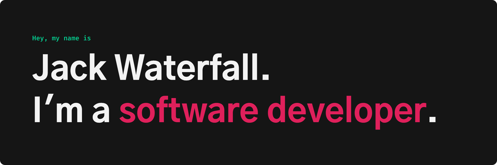

I’m a Derby-based full stack software developer with a passion for building scalable, reliable and accessible software. I have experience with technologies such as React, NextJS, Typescript, Express and MongoDB. Check out my [portfolio](https://jack-waterfall.com)!

{
    "$schema": "http://json-schema.org/draft-04/schema#",
    "description": "Modified JSON Schema draft v4 that includes the optional '$ref' and 'format'",
    "type": "object",
    "properties": {
        "people": {
            "allOf": [
                {
                    "type": "array",
                    "items": {
                        "type": "object",
                        "properties": {
                            "name": {
                                "type": "string"
                            },
                            "age": {
                                "type": "number"
                            }
                        }
                    }
                },
                {
                    "not": {
                        "type": "array",
                        "items": {
                            "not": {
                                "type": "object",
                                "properties": {
                                    "name": {
                                        "const": "string"
                                    }
                                },
                                "required": ["name"]
                            }
                        }
                    }
                }
            ]
        }
    }
}
